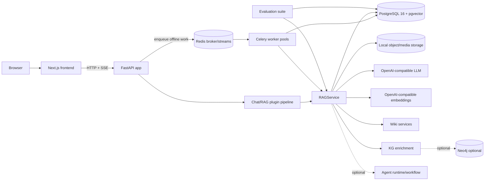

# Architecture

This repository is a two-tier RAG application:

- `frontend/`: Next.js App Router UI for chat, knowledge-base browsing, uploads, document preview, Wiki, feedback, and evaluation entry points.
- `backend/`: FastAPI app that owns parsing, chunking, PostgreSQL storage, pgvector retrieval, streaming generation, Wiki generation, KG enrichment, memory, audit, and evaluation.

PostgreSQL 16 with pgvector is the active production persistence platform. SQLite, FTS5, Chroma, and Milvus artifacts are legacy data only.

## Topology

## Backend Layers

| Layer | Main files | Responsibility |
|---|---|---|
| Entrypoint | `backend/app/main.py` | env loading, service wiring, routes, startup hooks, health diagnostics |
| Online Chat/RAG pipeline | `backend/app/services/chat_pipeline/` | Weknora-style typed stage context, plugin registry, ordered executor, quick-chat orchestration, retrieval-only subset |
| RAG orchestration | `backend/app/services/retrieval/rag_service.py` | ingest, retrieval, context assembly, answer generation, feedback write-back |
| PostgreSQL foundation | `backend/app/services/storage/postgres*.py` | database settings, pooling, final schema creation, startup compatibility checks |
| Document evidence | `backend/app/services/documents/postgres_*repository.py` | documents, chunks, upload batches, images, keyword search rows |
| Vector retrieval | `backend/app/services/retrieval/postgres_vector_store.py` | chunk embeddings in pgvector with workspace/KB/doc filters before ranking |
| Keyword retrieval | `backend/app/services/retrieval/keyword_search.py` and `PostgresDocumentRepository.search_keyword_chunks` | PostgreSQL full-text, trigram, and exact fallback search |
| Wiki | `backend/app/services/wiki/postgres_wiki_repository.py`, `wiki_service.py`, `wiki_ingest_service.py` | scoped pages, folders, issues, proposals, generation tasks, contribution/log state |
| Processing runtime | `backend/app/services/processing/postgres_*repository.py` | durable task queue, leases, dead letters, span trace tree |
| Async runtime | `backend/app/services/async_runtime/`, `backend/app/workers/` | Redis/Celery queue facade, task envelopes, Weknora-style queue routing, external worker entrypoints |
| KG | `backend/app/services/kg/postgres_kg_repository.py`, `entity_vector_store.py` | KG tasks, entity mentions, optional entity pgvector search, optional Neo4j graph writes |
| Memory and audit | `backend/app/services/memory/postgres_*repository.py`, `knowledge/postgres_audit_repository.py` | conversations, memories, query logs, answer feedback |
| Evaluation | `backend/app/services/evaluation/postgres_evaluation_repository.py` | eval runs/results stored outside the retrievable corpus |

## Storage Layout

PostgreSQL owns authoritative business records and derived retrieval indexes in one schema:

- workspace and knowledge-base lifecycle rows
- document identity, upload batches, parse status, chunks, image resources, and image operation rows
- keyword-search columns and indexes derived from authoritative chunk rows
- pgvector chunk embeddings in `document_chunk_embedding`
- Wiki folders/pages/issues/proposals/source refs/contributions/pending/log rows
- processing tasks, dead letters, and span traces
- KG extraction tasks, entity mentions, optional entity embeddings, and graph summary placeholders
- conversations, messages, memories, query logs, answer feedback, evaluation runs, and evaluation results

Local filesystem state remains for source corpus files, managed uploads, generated feedback markdown, media objects, trace artifacts, eval reports, runtime locks, and reset manifests. These files are coordinated by the app but are not a replacement for PostgreSQL records.

## Async Runtime

Bee can run upload, Wiki, enrichment, and maintenance work through a Redis-backed Celery runtime. Redis owns scheduling and delivery; PostgreSQL remains authoritative for task rows, attempts, spans, cancellations, and dead letters. The worker pools mirror Weknora's isolation model:

- Core: document parsing/chunking and coarse `upload_file.process` work
- PostProcess: knowledge post-processing
- Enrichment: summaries, generated questions, multimodal, and graph extraction
- Wiki: `wiki.ingest` and `wiki.finalize`
- Maintenance: cleanup, sync, reconciliation, and repair
- Shared: optional overflow capacity for selected queues

When Celery mode is disabled, the existing PostgreSQL/local worker path remains available for development and fallback.

## Ingest And Retrieval

Ingest parses source documents, writes document/chunk rows to PostgreSQL, writes indexable chunk embeddings to pgvector, and records processing spans. The vector store no longer resets a global collection during KB-local ingest; document and KB operations use scoped deletes/rebuilds.

Retrieval flow:

1. Resolve `KnowledgeBaseScope` from request KB/document selectors.
2. Run optional query understanding and query expansion.
3. Fan out dense retrieval through pgvector with workspace/KB/doc filters applied before ranking.
4. Fan out keyword retrieval through PostgreSQL text/trigram/exact search with the same scope filters.
5. Fuse candidates with weighted RRF, dedupe by chunk id, optionally rerank, and recall parent/table/OCR/image context from PostgreSQL.
6. Verify citations and assemble final answer context.

## Wiki Layer

LLM Wiki is a scoped business-data layer on top of raw document evidence. Wiki pages, folders, source refs, issues, proposals, aliases, generation tasks, contribution manifests, pending operations, and logical logs live in PostgreSQL. Wiki generation reads persisted source chunks directly, writes reviewable page/proposal state, and does not replace raw evidence retrieval.

## Knowledge Graph

KG enrichment is optional and default-disabled. When enabled, extraction tasks and entity mentions are stored in PostgreSQL after document chunks are persisted. Entity vector search uses PostgreSQL pgvector. Neo4j remains optional for graph relations/paths; graph evidence is accepted only when its source chunk ids resolve inside the requested PostgreSQL scope.

## Evaluation

Evalsets live under `backend/evalsets` and are not ingested as knowledge documents. Runs and per-case results are stored in PostgreSQL; JSON/Markdown reports are filesystem artifacts under the configured eval report directory. Evaluation does not write feedback, memory, graph, or vector data.

## Chat Streaming Runtime

The chat path keeps the public `/chat/stream` SSE contract compatible while gaining an internal EventBus and StreamManager foundation. Stream events can be stored by session/message identity with monotonic offsets, allowing replay semantics without changing old clients that consume `sources`, `reasoning`, `token`, `final`, `error`, and `[DONE]`.

Durable chat history lives in the relational `conversation` and `conversation_message` tables. These tables act as WeKnora-compatible sessions/messages: sessions carry `tenant_id`, `user_id`, and `agent_config`; messages carry `request_id` and `is_completed`. Redis is not a history cache. It is used only for transient stream replay buffers shaped as `stream:events:{sessionId}:{messageId}` and for temporary web-search knowledge state.

New chat turns create a completed user row and an incomplete assistant placeholder before generation starts. The assistant row is completed exactly once after normal completion or user stop, while the frontend renders the active answer from SSE events. Message history is loaded from PostgreSQL through cursor pagination; prompt context uses a separate bounded recent-message query so long transcripts do not enter prompts wholesale.

Quick Chat/RAG can additionally run through `backend/app/services/chat_pipeline/` when `CHAT_RAG_PIPELINE_ENABLED=true`. The pipeline uses a typed request/state/runtime context and ordered plugin stages for conversation bootstrap, history, memory, query understanding, hybrid retrieval, parent recall, source/reasoning/trace emission, streamed completion, assistant persistence, memory storage, and terminal completion. Public events still flow through `ChatEventBus` into `StreamManager`, so replay and old SSE clients keep the same behavior. The raw quick-chat path remains available when the flag is disabled.

`STREAM_MANAGER_TYPE=redis` enables cross-process replay and distributed stop propagation. If the setting is absent, `MemoryStreamManager` supports only local single-process streaming; refresh replay can fail after process restart or cross-replica routing. Production multi-replica deployments should configure Redis and the stream TTL via `STREAM_EVENT_TTL_SECONDS` when the 24 hour default is not appropriate.

Stopping generation is represented as a stream event. `POST /api/v1/sessions/{session_id}/stop` verifies scoped message ownership, appends a `stop` event, and lets the active SSE loop or a 300ms stop watcher signal runtime cancellation. The runtime saves the accumulated partial assistant content with `is_completed=true` and marks stopped metadata without indexing the partial answer as feedback knowledge.

The same package exposes a retrieval-only stage subset for future search/evaluation/tool callers that need query understanding, hybrid retrieval, parent recall, filtering, and debug metadata without invoking chat completion or persisting assistant messages.

## Reset And Compatibility

Normal startup validates PostgreSQL schema generation, pgvector type/dimension, required columns, and index readiness. Incompatible storage reports `reset_required` and fails closed rather than importing old SQLite rows or Milvus vectors.

Destructive clean-rebuild has no HTTP API. Operators must stop API/workers and run `python -m app.scripts.rebuild_knowledge_storage` with the exact confirmation phrase. The coordinator writes maintenance/manifest state, drops and initializes the PostgreSQL schema, retires legacy SQLite/Milvus artifacts, optionally handles Neo4j and managed files, and only clears maintenance after success.
